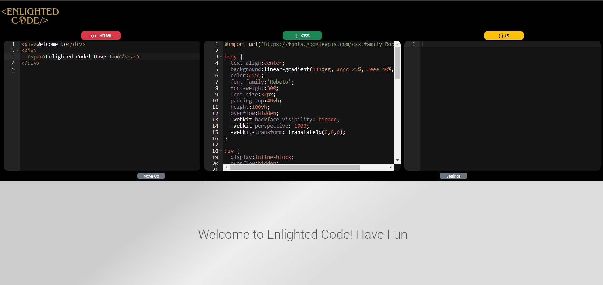

# EnlightedCode

A simple HTML, CSS, and JS editor inspired by CodePen, built using React with Bootstrap styles and custom hooks.

[https://enlighteddev.github.io/EnlightedCode/](https://enlighteddev.github.io/EnlightedCode/)


## Features

- **HTML Editor:** Write and edit HTML code in a dedicated editor.
- **CSS Editor:** Style your HTML content with the integrated CSS editor.
- **JS Editor:** Add interactivity using the JavaScript editor.
- **Live Output:** Instantly see the result of your code in the live output section.
- **Responsive Design:** Utilizes Bootstrap styles for a polished and responsive user interface.
- **Custom Hooks:** Incorporates custom React hook for local Storage.

## Demo



## Getting Started

Follow these instructions to get a copy of the project up and running on your local machine. ***This app is not created using npx create-react-app.***

## Prerequisites

- Node.js and npm installed on your machine.

## Installation

1. Clone the repository:

   ```bash
   git clone https://github.com/EnlightedDev/EnlightedCode.git

2. Navigate to the project directory:

    ```bash
    cd EnlightedCode

3. Install Dependencies:

     ```bash
     npm install

## Usage

1. Start the development Server:

     ```bash
     npm start

2. Open the browser and go to [http://localhost:8080](http://localhost:8080)

3. Use the HTML, CSS, and JS editors to write your code.

4. See the live output in the dedicated output section.


## Contributing

Contributions are welcome! Please follow these guidelines:

* Fork the repository.
* Create a new branch for your feature or bug fix.
* Make your changes and submit a pull request.
